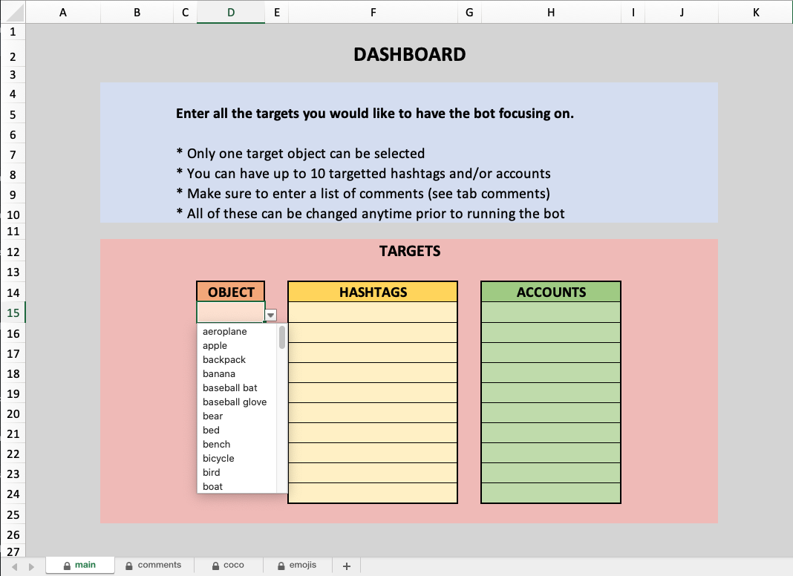

# botwizer

Final Project for CSCI E-29, Fall 2020, Harvard University

<br>


[](https://travis-ci.com/DevGlitch/botwizer)
[](https://codeclimate.com/github/DevGlitch/botwizer/maintainability)
[](https://codeclimate.com/github/DevGlitch/botwizer/test_coverage)
[](https://github.com/DevGltich/botwizer/master/LICENSE)


<!-- PROJECT LOGO -->
<br />
<p align="center">
  <a href="https://github.com/DevGlitch/botwizer">
    
  </a>
</p>

<br>

<!-- DEMO OF THE PROJECT -->
## Demo of The Project

Coming Soon
[](https://youtu.be/....)


<!-- GETTING STARTED -->
## Getting Started

Follow the below instructions in order to be able to use Botwizer on your machine.

### Prerequisites

* Firefox
   ```python
  $ brew install --cask firefox
  
  # or directly via their website:
  https://www.mozilla.org/en-US/firefox/new/
  ```

* Geckodriver
   ```python
  $ brew install geckodriver
  
  # or manually:
  https://github.com/mozilla/geckodriver
  ```


### Installation

1. Clone the repo
   ```sh
   git clone https://github.com/DevGlitch/botwizer.git
   ```

2. Download weights file
   ```python
   # Place this file in yolo.weights
   https://pjreddie.com/media/files/yolov3.weights 
   ```

2. Create .env file with your credentials
   ```python
   # in .env
   username=________  # Your Insta username
   password=________  # Your Insta password
   ```

3. Add your targets and comments in dashboard.xlsx (Don't forget to save!)
    <p align="center">
      <a href="https://github.com/DevGlitch/botwizer">
        
      </a>
    </p>


### Options

1. Firefox headless mode
   ```python
   # actions.login
   opts.headless = True  # Browser running in background
   #or
   opts.headless = False # Browser visible when botwizer is running
   ```


### Running

To run botwizer
   ```
   python3 -m final_project
   ```

<!-- LICENSE -->
## License

Distributed under the MIT License. See `LICENSE` for more information.


<!-- CONTACT -->
## Contact

Nicolas Morant - [LinkedIn](https://www.linkedin.com/in/nicolasmorant/)

Project Link: [https://github.com/DevGlitch/botwizer](https://github.com/DevGlitch/botwizer)
